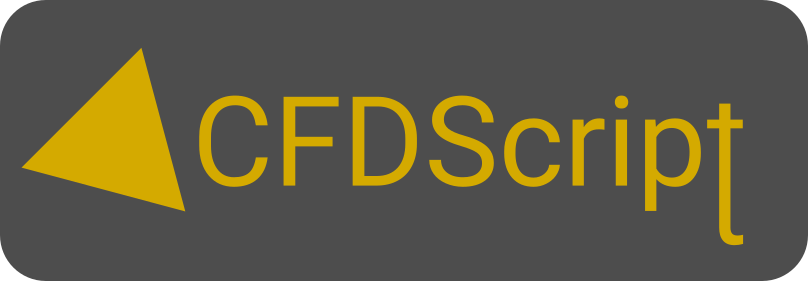

# CFDScript

An open-source browser-based software to solve partial differential equations (PDE) using the Finite Element Method (FEM). ***This project is under heavy development at this stage. Don't consider using it for the moment.***
  

<!-- ## Start here 
See the 
This project is actively maintained on -->

<!-- ## Disclaimer
This software is provided as-is, without any warranty, expressed or implied. The authors and copyright holders of this software shall not be liable for any claim or damages arising from its use. -->